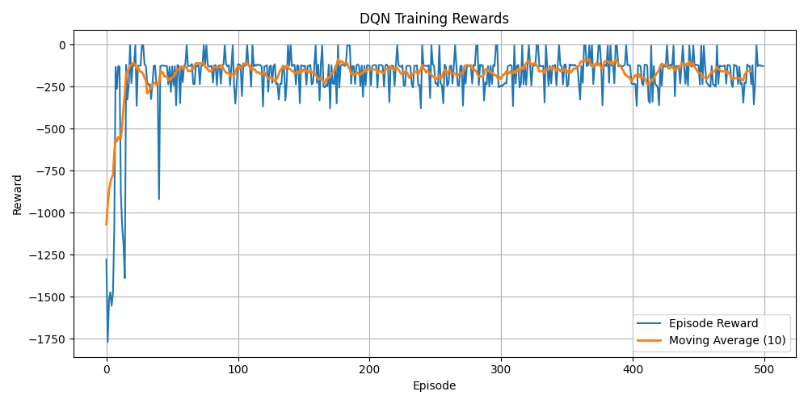

# Inverted Pendulum DQN

This repository contains the code implementations for various checkpoints achieved during the FinSearch Project for the group F33. 

Currently for the mid-term report, it contains code that implements a Deep Q-Network (DQN) agent to solve the classic control problem of balancing an inverted pendulum using the OpenAI Gym `Pendulum-v1` environment.

The agent learns to balance the pendulum by applying discrete torque values, optimizing its policy through experience replay and target network updates.

## Training Reward

The following plot shows the episode rewards during training:

## Demo Video

